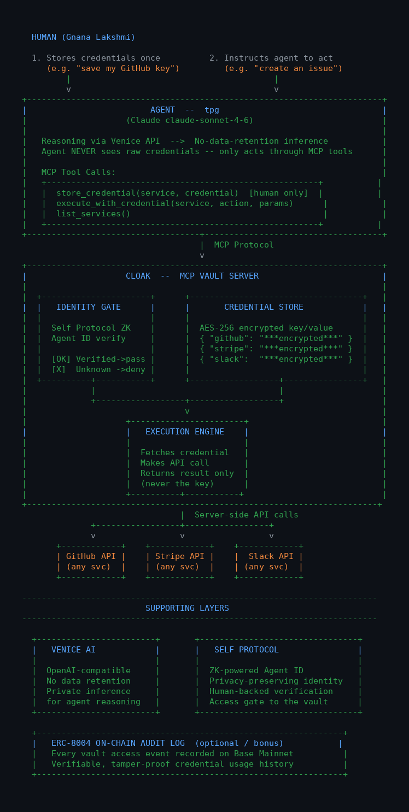

# Cloak — Secret-less Agent Execution

> The credential vault for the agent era. AI agents take authorized actions on external services without ever seeing the secrets they need.

---

## The Problem

Every AI agent that integrates with an external service becomes a credential liability.

To call GitHub, Stripe, or Slack, the agent needs a secret. So the secret ends up in:
- The LLM's context window
- Application logs
- Prompt injection attack surface
- Potentially AI training pipelines

This isn't a niche problem. It's happening at scale right now — every vibe coder pasting API keys into Cursor, every startup wiring agents into payment infrastructure, every devops team giving a bot a GitHub PAT.

There is no standard infrastructure for agents to perform authorized actions without being exposed to the secrets they need.

**Cloak fixes this.**

---

## What Cloak Does

Cloak is an MCP (Model Context Protocol) server that acts as a credential vault between AI agents and external APIs.

```
Agent (Claude / Cursor / Windsurf)
       │
       │  "list my GitHub repos"  ←  no key ever given to agent
       ▼
  ┌─────────────┐
  │    Cloak    │   ← vault + identity gate + executor
  └─────────────┘
       │
       │  Bearer ghp_••••••••  ←  credential used server-side, never returned
       ▼
  External API (GitHub / Stripe / Slack)
       │
       └── result only ──► Agent
```

The agent requests an action. Cloak:
1. Verifies the agent's identity via Self Protocol ZK
2. Retrieves the encrypted credential from the vault
3. Executes the action server-side using Venice's private inference
4. Returns only the result — the credential never leaves Cloak

---

## Who It's For

### Vibe Coders / AI-First Developers

People building with Cursor, Claude Code, Windsurf, Copilot — they constantly paste API keys into AI context to get help. Every time:
- The key is in the LLM's context window
- It's in logs and conversation history
- It could end up in AI training data

**Cloak for them:** Install once as an MCP server. Every AI tool connects to Cloak instead of your keys. Never paste a secret into a chat again.

### Businesses Running AI Agents

Companies automating workflows — customer support bots, coding agents, payment agents — where an agent needs to call Stripe, send Slack messages, push to GitHub.

One compromised agent context = full API access. For fintech, that's a financial liability. For devops, that's a breach.

**Cloak for them:** The credential layer that sits between their agent fleet and their APIs — with audit logs, identity verification, and zero secret exposure.

---

## How It Works

### MCP Tools

Cloak registers four tools available to any MCP-compatible AI client:

| Tool | Who can call | What it does |
|---|---|---|
| `store_credential` | Human only | Encrypts and vaults an API key for a named service |
| `list_services` | Agent | Lists service names — no keys exposed |
| `execute_with_credential` | Agent | Performs an action against a service; agent gets only the result |
| `remove_credential` | Human only | Deletes a stored credential |

### Encryption

Credentials are encrypted at rest using AES-256-GCM with per-credential salts. Keys are derived via scrypt from a master secret. Plaintext never leaves the vault process.

### Supported Services (v1)

- **GitHub** — get user, list repos, create issues
- **Slack** — list channels, post messages
- **Stripe** — get balance, list customers

### Web Dashboard

A React + Vite dashboard provides a UI for managing the vault, triggering actions, and viewing the audit chronicle — without exposing credentials to the browser.

---

## Partner Integrations

### Venice AI — Private Cognition Layer

> Track: *Private Agents, Trusted Actions*

Venice provides no-data-retention inference. Cloak routes all agent reasoning through Venice's API — meaning the agent's thought process over sensitive data (which services to call, what parameters to use, how to interpret results) never persists anywhere.

This closes the second leak vector. Cloak handles the credential side; Venice handles the cognition side. Together:

- **Credentials** never enter the agent context (Cloak)
- **Reasoning** never persists in inference logs (Venice)

An agent that calls Stripe through Cloak via Venice has no persistent footprint — not in the vault (only encrypted blobs), not in the inference layer (no data retention). Private cognition meets private action, end to end.

**Integration:** Agent reasoning is performed via Venice's OpenAI-compatible API with `no-data-retention` mode. The Cloak execution engine consults Venice when making multi-step decisions (e.g. which action fits the user's intent, how to format parameters).

### Self Protocol — ZK Agent Identity

> Track: *Best Self Protocol Integration*

The `execute_with_credential` tool accepts an optional `self_agent_id` parameter. When present, Cloak verifies the agent's identity against Self Protocol's ZK-powered Agent ID before executing any action.

This makes the identity layer **load-bearing**, not decorative:

- Without a valid Self Agent ID, execution is blocked in strict mode
- Businesses can gate access to high-value credentials (payment APIs, admin tokens) behind verified agent identities
- Supports Sybil-resistant agent workflows — you know exactly which agent identity is taking action

**Modes:**
- `SELF_STRICT_MODE=true` — rejects any unverified agent, required for production
- Default (dev) — warns but allows, enabling fast iteration

**Why this matters:** As agent-to-agent communication grows, credential theft via impersonation becomes a real attack vector. Self Protocol's ZK verification ensures the agent requesting action is who it claims to be — without exposing private identity data.

### Slice — ERC-8128 Web Auth for Agents

> Track: *Ethereum Web Auth / ERC-8128*

ERC-8128 is purpose-built for what Cloak needs: a standard auth primitive that works for both humans and agents, without API keys.

Cloak integrates ERC-8128 as an authentication layer for its REST API and dashboard:

- **Agent access:** Agents authenticate to Cloak's execution endpoint via ERC-8128 signature challenge, replacing static API tokens
- **Human access:** Dashboard users authenticate via ERC-8128 wallet signing (SIWE-style), no passwords
- **Seamless handoff:** The same auth primitive works across the human-agent boundary — a human approves, an agent executes, both verified the same way

This is the full circle: Cloak replaces secrets for downstream APIs, and ERC-8128 replaces secrets for accessing Cloak itself. The entire stack becomes secret-less.

---

## Architecture

```
┌────────────────────────────────────────────────────────────┐
│                        AI Client                           │
│         (Claude Code / Cursor / Windsurf / custom)         │
└────────────────┬───────────────────────────────────────────┘
                 │ MCP protocol
                 ▼
┌────────────────────────────────────────────────────────────┐
│                     Cloak MCP Server                       │
│                                                            │
│  ┌──────────────┐   ┌──────────────┐   ┌───────────────┐  │
│  │  Tool Layer  │   │  Identity    │   │ Vault (AES-   │  │
│  │  (MCP SDK)   │──▶│  Gate        │──▶│  256-GCM)     │  │
│  └──────────────┘   │ (Self ZK)    │   └──────┬────────┘  │
│                     └──────────────┘          │           │
│                                               ▼           │
│                                    ┌──────────────────┐   │
│                                    │  Execution Engine │   │
│                                    │  (Venice inference│   │
│                                    │   + service calls)│   │
│                                    └──────────┬───────┘   │
└───────────────────────────────────────────────┼───────────┘
                                                │ result only
                    ┌───────────────────────────┤
                    ▼                           ▼
              GitHub API                  Stripe API
              Slack API                   (+ 100s more)
```



---

## Use Cases

### Payment Infrastructure
A Stripe agent that can charge customers, issue refunds, and create subscriptions — without the AI model ever holding the secret key. One compromised agent context no longer means financial exposure.

### Vibe Coders
Store your keys once with Cloak. Every AI tool you use (Cursor, Claude Code) connects via MCP — call GitHub, push code, manage issues — without pasting a secret into any chat.

### Business Automation
- HR bot sends Slack messages without knowing the Slack token
- Support bot creates Stripe refunds without touching payment credentials
- DevOps agent pushes to GitHub without holding the PAT
- Audit log proves what every agent did and when

---

## The Vision

Cloak is to the agent era what HashiCorp Vault was to the DevOps era.

When infrastructure-as-code took off, secrets management became a solved problem for humans. Vault gave DevOps teams a standard credential layer. Nobody questions it now.

AI agents are the new infrastructure. They're being given real API access, real money movement ability, real system access. But there is no standard credential layer for agents yet.

The timing is perfect. Everyone is building AI agents right now. Almost nobody is thinking seriously about credential security. Cloak can be that standard — starting as an MCP server for technical users, growing into a hosted vault-as-a-service for teams.

### Go-To-Market

| Phase | What | Target |
|---|---|---|
| Now | MCP server, open source | Technical users, vibe coders |
| Next | Submit to MCP marketplace | Cursor/Claude Code plugin discovery |
| Then | Hosted cloak.dev — 3 free credentials | Self-serve teams |
| Native | Cursor/Windsurf plugin | AI-first developer mainstream |
| Enterprise | Team vaults, SSO, audit logs, role-based access | Businesses running agent fleets |

---

## Tech Stack

| Layer | Technology |
|---|---|
| MCP server | `@modelcontextprotocol/sdk`, TypeScript |
| Encryption | AES-256-GCM, scrypt key derivation, Node.js crypto |
| Agent identity | Self Protocol ZK Agent ID |
| Private inference | Venice AI (no-data-retention API) |
| Web auth | Slice ERC-8128 |
| Dashboard | React 18, Vite, Tailwind CSS |
| API server | Express, TypeScript |

---

## Getting Started

### MCP Server (Claude Desktop / Cursor)

```bash
# Clone and install
git clone https://github.com/tpgGirls/synthesishack
cd synthesishack && npm install && npm run build

# Add to your MCP config (Claude Desktop: ~/Library/Application Support/Claude/claude_desktop_config.json)
{
  "mcpServers": {
    "cloak": {
      "command": "node",
      "args": ["/path/to/synthesishack/dist/index.js"],
      "env": {
        "CLOAK_MASTER_SECRET": "your-secret-passphrase-min-16-chars"
      }
    }
  }
}
```

### Web Dashboard

**Live demo:** https://frontend-cyan-nine-88.vercel.app

```bash
cd frontend && npm install && npm run dev
# Vite UI: http://localhost:5173
# Express API: http://localhost:3001
```

### Environment Variables

| Variable | Required | Description |
|---|---|---|
| `CLOAK_MASTER_SECRET` | Yes | Master passphrase for vault encryption (min 16 chars) |
| `CLOAK_VAULT_PATH` | No | Custom path for vault file (default: `~/.cloak/vault.json`) |
| `SELF_STRICT_MODE` | No | Set `true` to require verified Self Agent ID for all executions |

---

## Built at Synthesis Hackathon 2026

**Team:** tpg's Team — tpg, bb007, Claude Code Agent, Claude

**Tracks:** Venice AI (Private Agents, Trusted Actions) · Self Protocol (Best Self Protocol Integration) · Slice (Ethereum Web Auth / ERC-8128) · Synthesis Open Track
